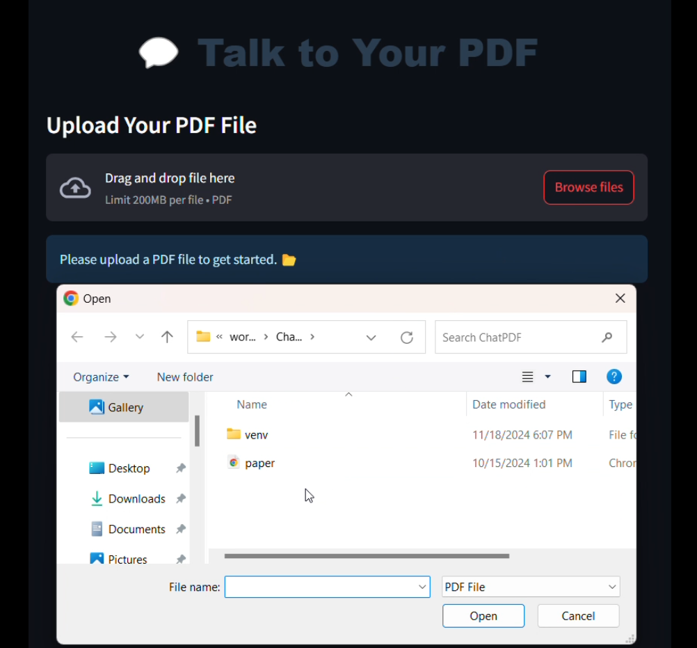
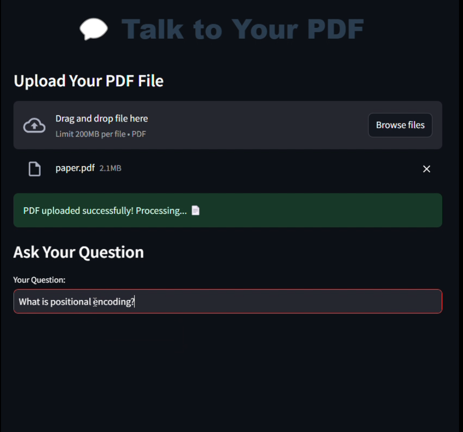
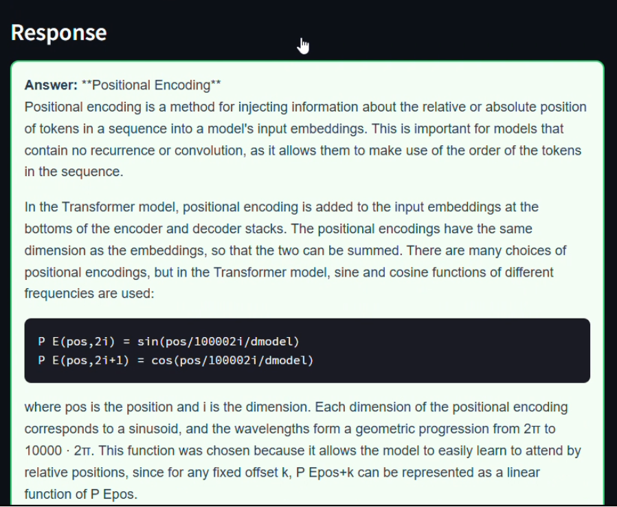

# ChatPDF: Intelligent PDF Document Interaction

## Project Description
ChatPDF is a Retrieval-Augmented Generation (RAG) system that enables advanced, context-aware interactions with PDF documents through semantic understanding and intelligent querying.

## Core Technologies
- Retrieval-Augmented Generation (RAG)
- Vector Database
- Embedding Techniques
- Natural Language Processing

## Key Capabilities
- Semantic document parsing
- Chunk-based content storage
- Context-aware question answering
- Advanced embedding for precise information retrieval

## 🎥 Demo  
Here’s how the app looks in action:  

## 🎥 Demo  
Here’s how the app looks in action:  

<div style="display: flex; gap: 10px;">
  
  
  
</div>
## Technical Architecture
1. PDF Document Processing
2. Semantic Chunking
3. Vector Database Embedding
4. Intelligent Query Resolution

## Installation
```bash
git clone https://github.com/RakeshTirlangi/ChatPDF.git
cd ChatPDF
pip install -r requirements.txt
